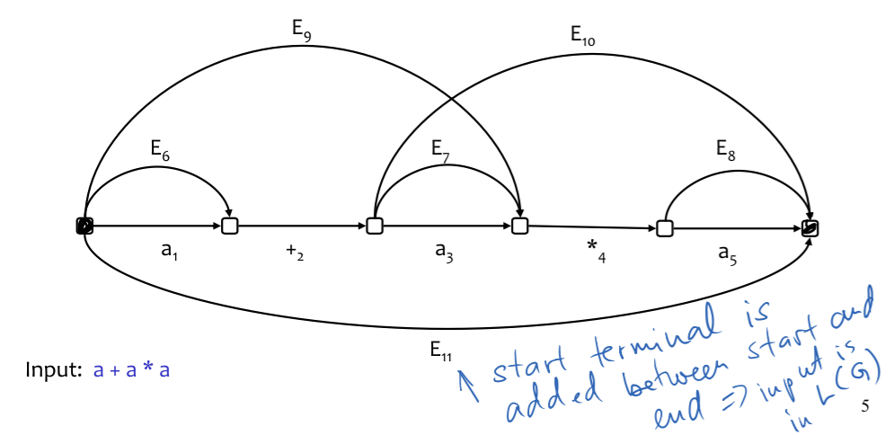

Parsing
---
### CYK, Earley, and ambiguity

Bottom up parsing, efficiency, and grammar disambiguation

CYK parser
---
* Start with terminals
* Add non terminal edges until no more can be added

CYK: algorithm theory
---
* Edge (i,j,T) added if i -> j forms production T
* i -> j forms RHS of grammar production

 

### On Chomsky Normal Form grammars
* O(n^3) time, O(n^2) space
* each grammar can be rewritten to Chomsky Normal Form
